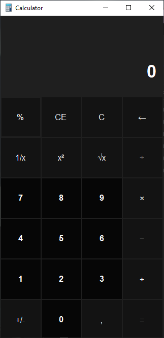
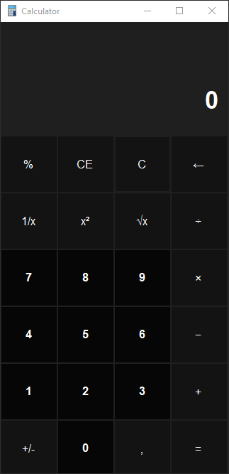

[![Contributors][contributors-shield]][contributors-url]
[![Forks][forks-shield]][forks-url]
[![Stargazers][stars-shield]][stars-url]
[![Issues][issues-shield]][issues-url]
[![MIT License][license-shield]][license-url]
[![LinkedIn][linkedin-shield]][linkedin-url]

  

  <h3 align="center">Calculator-CSharp-Form</h3>

  

    It is a calculator project similar to Windows 10 calculator using C # Form.
   </a>
     
     
    
    
     
     
    <a href="https://github.com/ahmet-cetinkaya/Calculator-CSharp-Form/issues">Report Bug</a>
  

<!-- TABLE OF CONTENTS -->

  
Table of Contents

  <ol>
    <li><a href="#usage">Usage</a></li>
    <li><a href="#license">License</a></li>
    <li><a href="#contact">Contact</a></li>
  </ol>

## Usage

You can run it from the `\ Calculator \ bin \ Debug \ Calculator.exe` directory.

## License

Distributed under the MIT License. See `LICENSE` for more information.

## Contact

Ahmet Çetinkaya - [@ahmetctnky_txt](https://twitter.com/ahmetctnky_txt) - [ahmetcetinkaya7@outlook.com](mailto:ahmetcetinkaya7@outlook.com)

<!-- REFERENCES -->

[contributors-shield]: https://img.shields.io/github/contributors/ahmet-cetinkaya/Calculator-CSharp-Form.svg?style=for-the-badge
[contributors-url]: https://github.com/ahmet-cetinkaya/Calculator-CSharp-Form/graphs/contributors
[forks-shield]: https://img.shields.io/github/forks/ahmet-cetinkaya/Calculator-CSharp-Form.svg?style=for-the-badge
[forks-url]: https://github.com/ahmet-cetinkaya/Calculator-CSharp-Form/network/members
[stars-shield]: https://img.shields.io/github/stars/ahmet-cetinkaya/Calculator-CSharp-Form.svg?style=for-the-badge
[stars-url]: https://github.com/ahmet-cetinkaya/Calculator-CSharp-Form/stargazers
[issues-shield]: https://img.shields.io/github/issues/ahmet-cetinkaya/Calculator-CSharp-Form.svg?style=for-the-badge
[issues-url]: https://github.com/ahmet-cetinkaya/Calculator-CSharp-Form/issues
[license-shield]: https://img.shields.io/github/license/ahmet-cetinkaya/Calculator-CSharp-Form.svg?style=for-the-badge
[license-url]: https://github.com/ahmet-cetinkaya/Calculator-CSharp-Form/blob/master/LICENSE
[linkedin-shield]: https://img.shields.io/badge/-LinkedIn-black.svg?style=for-the-badge&logo=linkedin&colorB=555
[linkedin-url]: https://www.linkedin.com/in/ahmet-cetinkaya/
